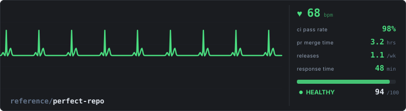
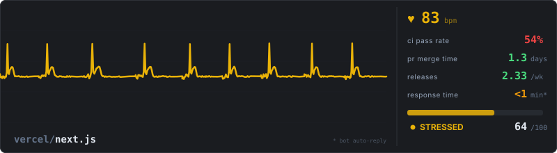

# Repo Health Pulse

Vital signs for open-source repositories, visualized as a cardiac monitor.

Instead of static badges, your repo gets a **living ECG** that pulses based on real health metrics. The waveform shape, speed, and rhythm are driven by actual data from the GitHub API.

**[Live Dashboard (286 repos)](https://andreahlert.github.io/repo-health-pulse/)**

---

## How It Works

The system collects four vital signs from any public GitHub repo and maps them to an ECG waveform using a Gaussian cardiac model:

| Vital Sign | Source | What it controls on the ECG |
|---|---|---|
| **CI Pass Rate** | GitHub Actions API | Rhythm regularity. Low CI = arrhythmia, irregular beats. Below 35% the P-wave disappears (atrial fibrillation). Below 30% the ST segment elevates (heart attack signal). |
| **PR Merge Time** | Pull Requests API | T-wave stress. Slow merges = elevated T-wave. Above 7 days the T-wave inverts (extreme cardiac stress). |
| **Release Cadence** | Releases API + Tags | Heart rate. Frequent releases = faster heartbeat. No releases = slow, bradycardic rhythm. Zero activity = flatline. |
| **Issue Response** | Issues Search API | Baseline stability. Slow response = noisy, wandering baseline between beats. |

Each repo gets a **unique waveform** generated from its individual metrics, using seeded randomness for deterministic output. Same repo always produces the same ECG.

---

## The Model

### Population-Based Scoring

Scores are **not** based on arbitrary ideals. They come from **real population data collected from 286 active GitHub repos** (1k to 500k stars). Each metric is scored as a percentile rank within the population.

A repo scoring 75 means it performs better than 75% of the population on that metric.

### Cohort System

A 500MB monorepo with 50 contributors is not comparable to a 5MB library with 2 contributors. The scoring system detects four cohorts by repo size and adjusts reference values accordingly:

| Cohort | CI Median | PR Merge Median | Release Median |
|---|---|---|---|
| Tiny (<10MB) | 55% | 84h | 0/wk |
| Medium (10-100MB) | 80% | 21h | 0/wk |
| Big (100-500MB) | 80% | 17h | 0.31/wk |
| Huge (500MB+) | 70% | 18h | 0.31/wk |

### Scoring Weights

Not all metrics carry equal weight. Release cadence gets less weight because 55% of repos don't use GitHub Releases at all (they use tags, channels, or other distribution mechanisms).

| Metric | Weight | Rationale |
|---|---|---|
| CI Pass Rate | 30% | Core signal of code health |
| PR Merge Time | 30% | Reflects team responsiveness |
| Issue Response | 25% | Community engagement |
| Release Cadence | 15% | Optional for many projects |

### Smart Edge Cases

- **Skipped CI runs** (cherry-pick workflows, conditional jobs) are excluded from pass rate. Only `success` and `failure` count.
- **No GitHub Releases?** Falls back to git tags. If no tags either, checks PR activity: repos with 15+ merged PRs get a neutral score instead of being penalized.
- **Bot auto-replies** on issues are detected and capped at score 50 to prevent artificial inflation.
- **Flatline detection**: repos with zero releases AND fewer than 5 merged PRs are marked as flatline regardless of other metrics.

### ECG Anatomy

The waveform uses a **Gaussian sum model** matching real ECG anatomy (Lead II):

| Wave | Real ECG Function | Proportion |
|---|---|---|
| P wave | Atrial contraction | ~1/8 of R height |
| Q wave | Septal depolarization | ~1/10 of R depth |
| R wave | Ventricular peak (dominant) | Reference (1.0) |
| S wave | Late ventricular activity | ~1/8 of R depth |
| T wave | Ventricular repolarization | ~1/4 of R height, asymmetric |

When heart rate increases, the **TP segment** (resting period) compresses while QRS width stays constant, matching real cardiac physiology.

---

## Population Analysis

Data collected from **286 active repos** across 10+ languages and star counts from 1k to 500k.

### Distribution

| State | Count | % | Description |
|---|---|---|---|
| Healthy | 24 | 8% | Top performers in their cohort |
| Stressed | 121 | 42% | Population average |
| Critical | 87 | 30% | Below cohort median |
| Flatline | 54 | 19% | Inactive or abandoned |

### Population Medians (the "normal patient")

| Metric | p25 | p50 (median) | p75 |
|---|---|---|---|
| CI Pass Rate | 35% | 75% | 95% |
| PR Merge Time | 7h | 27h | 119h |
| Releases/week | 0 | 0 | 0.3 |

### Key Findings

- **55% of repos don't use GitHub Releases.** Release cadence cannot be a primary health signal.
- **CI of 75% is normal.** Large monorepos have flaky infrastructure tests, not bad code.
- **PR merge time of 1 day is standard.** Not a sign of dysfunction.
- **Huge repos (500MB+) merge PRs faster** than tiny repos (18h vs 84h median). More reviewers, more process.
- **Old repos (11y+) have better CI** than young ones (80% vs 55%). Mature pipelines.

---

## Showcase

### Reference: The Healthy Patient

What a perfectly healthy repo looks like: CI 98%, PRs merging in 3h, weekly releases, issues answered in under an hour. Calm 68 bpm, regular sinus rhythm, clean baseline.



### Real Repos







### Minimal View


### Badge View

| Repo | Badge |
|---|---|
| astral-sh/ruff |  |
| microsoft/vscode |  |
| apache/airflow |  |
| flutter/flutter |  |

---

## Quick Start

### GitHub Action

Add to `.github/workflows/health-pulse.yml`:

```yaml
name: Health Pulse

on:
  release:
    types: [published]
  pull_request:
    types: [closed]
  schedule:
    - cron: '0 6 * * *'
  workflow_dispatch:

permissions:
  contents: write
  actions: read
  pull-requests: read
  issues: read

jobs:
  pulse:
    runs-on: ubuntu-latest
    if: github.event_name != 'pull_request' || github.event.pull_request.merged == true
    steps:
      - uses: actions/checkout@v4
      - uses: andreahlert/repo-health-pulse@main
        with:
          format: monitor
          output-path: .github/health-pulse.svg
      - uses: stefanzweifel/git-auto-commit-action@v5
        with:
          commit_message: "Update health pulse [skip ci]"
          file_pattern: ".github/health-pulse.svg"
```

Then in your README:

```markdown

```

### CLI

```bash
npx repopulse apache/airflow                                    # stdout
npx repopulse microsoft/vscode --format mini --output health.svg
npx repopulse                                                   # detects from git remote
```

### Formats

| Format | Size | Use case |
|---|---|---|
| `monitor` | 800x220 | Full dashboard with ECG + vital signs panel |
| `mini` | 480x80 | Compact, just ECG line + score |
| `badge` | 280x32 | Inline, shields.io style |

---

## Action Reference

### Inputs

| Input | Default | Description |
|---|---|---|
| `token` | `github.token` | GitHub token with read access |
| `format` | `monitor` | `monitor`, `mini`, or `badge` |
| `output-path` | `.github/health-pulse.svg` | Where to write the SVG |

### Outputs

| Output | Description |
|---|---|
| `score` | Composite health score (0-100) |
| `state` | `healthy`, `stressed`, `critical`, or `flatline` |
| `bpm` | Display BPM value |

---

## Known Limitations

- **GitHub-only metrics.** Projects using LKML, Bugzilla, or other tools appear less active than they are (e.g., Linux kernel).
- **Release detection.** Some projects use custom distribution channels not visible via GitHub API (e.g., Flutter uses `flutter upgrade` channels).
- **Response time skew.** Repos with 10k+ open issues naturally have slower median response times. This is measured, not penalized unfairly.
- **CI architecture varies.** Monorepos may have hundreds of workflow files, some experimental. The 30-run sample may not be representative.

## License

MIT
