# Repo Health Pulse

Real-time repository vital signs, visualized as a cardiac monitor.

All data below is **generated automatically** from the GitHub API via CI.

---

## Reference: The Perfect Patient

What does a perfectly healthy repository look like? CI at 98%, PRs merging in 3h, weekly releases, issues answered in under an hour. Calm resting heart rate at 68 bpm, regular sinus rhythm, clean baseline.


Every repo below is compared against this baseline. The further the metrics deviate, the more the ECG deforms:

| Deviation | What happens to the ECG |
|---|---|
| CI drops below 35% | P-wave disappears, atrial fibrillation (noisy baseline between beats) |
| CI drops below 30% | ST segment elevates (injury current, heart attack signal) |
| PR merge time increases | T-wave grows taller (cardiac stress). Above 7 days, T-wave inverts |
| Releases slow down | Heart rate drops, longer pauses between beats (bradycardia) |
| Releases stop completely | Flatline with slow wandering baseline (asystole) |
| Response time increases | Baseline becomes unstable, drifts between beats |

---

## Showcase

### Monitor View (800x220)


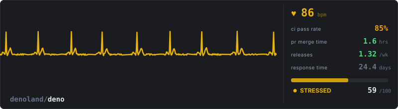


---

### Minimal View (480x80)


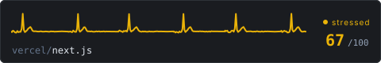

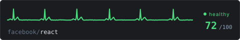


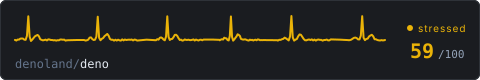

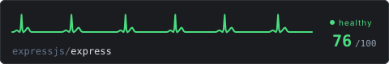

---

### Badge View (280x32)

| Repo | Badge |
|---|---|
| microsoft/vscode |  |
| astral-sh/ruff |  |
| apache/airflow |  |
| vercel/next.js | 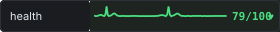 |
| facebook/react | 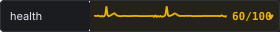 |
| kubernetes/kubernetes | 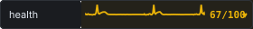 |
| denoland/deno | 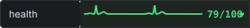 |
| expressjs/express | 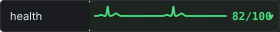 |

---

## Quick Start

### Option 1: GitHub Action (recommended)

Add to your repo's `.github/workflows/health-pulse.yml`:

```yaml
name: Health Pulse

on:
  release:
    types: [published]
  pull_request:
    types: [closed]
  schedule:
    - cron: '0 6 * * *'
  workflow_dispatch:

permissions:
  contents: write
  actions: read
  pull-requests: read
  issues: read

jobs:
  pulse:
    runs-on: ubuntu-latest
    if: github.event_name != 'pull_request' || github.event.pull_request.merged == true
    steps:
      - uses: actions/checkout@v4
      - uses: andreahlert/repo-health-pulse@main
        with:
          format: monitor
          output-path: .github/health-pulse.svg
      - uses: stefanzweifel/git-auto-commit-action@v5
        with:
          commit_message: "Update health pulse [skip ci]"
          file_pattern: ".github/health-pulse.svg"
```

Then add to your README:

```markdown

```

### Option 2: CLI

```bash
npx repopulse apache/airflow                                    # stdout
npx repopulse microsoft/vscode --format mini --output health.svg
npx repopulse                                                   # detects from git remote
```

### Formats

| Format | Size | Use case |
|---|---|---|
| `monitor` | 800x220 | Full dashboard with ECG + vital signs panel |
| `mini` | 480x80 | Compact, just ECG line + score |
| `badge` | 280x32 | Inline, shields.io style |

---

## How Scoring Works

Data comes from GitHub API. Each metric maps to a 0-100 sub-score, then averaged into a composite.

| Metric | What it measures | Source | Scoring |
|---|---|---|---|
| CI Pass Rate | % of successful workflow runs (last 30) | Actions API | 100% = 100, 90% = 75, 80% = 50, <70% = 25 |
| PR Merge Time | Median time from open to merge | Pulls API | <4h = 100, <24h = 75, <3d = 50, <7d = 25, >7d = 0 |
| Releases | Releases per week (rolling 90 days) | Releases API | >2/wk = 100, ~weekly = 80, biweekly = 60, monthly = 40, none = 0 |
| Response Time | Median first response on new issues | Search API | <2h = 100, <12h = 75, <48h = 50, <7d = 25, >7d = 0 |

### ECG Mapping

| Score | Waveform | Speed | Color |
|---|---|---|---|
| 80-100 | Normal sinus rhythm | 4s cycle | Green `#4ade80` |
| 60-79 | Faster rhythm, taller T-waves | 2.5s cycle | Amber `#eab308` |
| 20-59 | Irregular intervals, distorted QRS | 3.5s cycle | Red `#ef4444` |
| 0-19 | Flatline with noise | 6s cycle | Gray `#6b7280` |

### Caveats

- **Bot replies inflate response time scores.** Kubernetes shows <1min response, but it's automated triage bots.
- **Monorepo workflows skew CI.** Large repos may have many workflow files, some experimental.
- **GitHub-only metrics.** Projects using LKML, Bugzilla, or other tools will appear less active than they are.
- **Release strategy varies.** Some projects use tags instead of GitHub Releases.

---

## Action Inputs

| Input | Default | Description |
|---|---|---|
| `token` | `github.token` | GitHub token with read access |
| `format` | `monitor` | SVG format: `monitor`, `mini`, or `badge` |
| `output-path` | `.github/health-pulse.svg` | Where to write the SVG |

## Action Outputs

| Output | Description |
|---|---|
| `score` | Composite health score (0-100) |
| `state` | `healthy`, `stressed`, `critical`, or `flatline` |
| `bpm` | Display BPM value |
