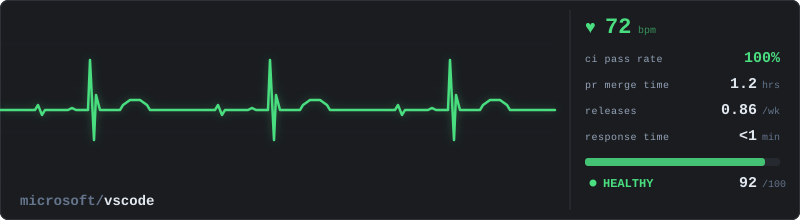
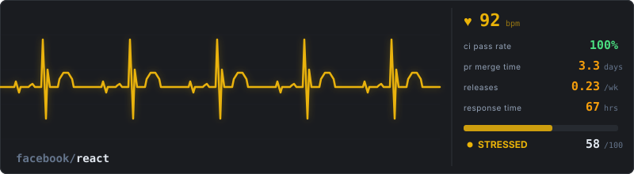
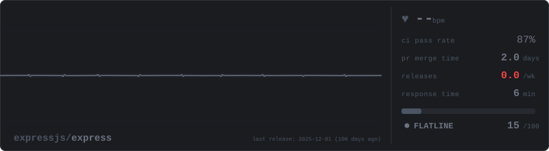
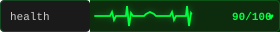
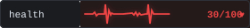
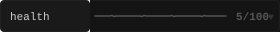

# Repo Health Pulse

Real-time repository vital signs, visualized as a cardiac monitor.

---

## Monitor View (800x220)

### Healthy — `owner/repo-name` — Score 90/100

Normal sinus rhythm. CI passing, fast PR reviews, regular releases, quick issue response.



---

### Stressed — `owner/legacy-api` — Score 66/100

Elevated heart rate. Flaky CI, slow PR reviews, declining release frequency.



---

### Critical — `owner/payment-service` — Score 30/100

Arrhythmia. CI failing, PRs stalling for days, almost no releases, issues going unanswered.



---

### Flatline — `owner/abandoned-project` — Score 5/100

No heartbeat. No CI runs, no PRs, no releases, no activity.



---

## Badge View (280x32)

Compact badges for inline use, same data, shields-style form factor.

| State | Badge |
|---|---|
| Healthy |  |
| Stressed |  |
| Critical |  |
| Flatline |  |

---

## Vital Signs Reference

| Metric | Label | What it measures | Data source |
|---|---|---|---|
| HR | Heart Rate | Composite health score (controls ECG speed) | Aggregate of all metrics |
| CI | CI Status | Build pass rate, avg build time, consecutive failures | GitHub Actions API |
| PR | PR Review Time | Median time from open to merge | Pull Requests API |
| RF | Release Frequency | Releases per week (rolling 30 days) | Releases/Tags API |
| IR | Issue Response | Median first response time on new issues | Issues API |

## How the ECG Changes

| Score | BPM | Waveform | Color |
|---|---|---|---|
| 80-100 | 60-80 | Normal sinus rhythm, clean PQRST | Green `#00ff41` |
| 60-79 | 80-100 | Faster rhythm, elevated T-waves | Yellow `#f0c030` |
| 20-59 | 100-130 | Irregular intervals, distorted waves | Red `#ff2020` |
| 0-19 | Flatline | Straight line with noise | Gray `#555555` |

## Usage (planned)

```markdown
<!-- Full monitor -->


<!-- Compact badge -->


<!-- Mini monitor (400x120) -->

```
