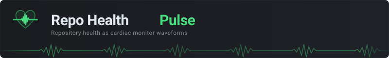

Your repository's vital signs, visualized as a cardiac monitor.

Instead of static badges, your repo gets a **living ECG** where the waveform shape, speed, and rhythm are driven by real metrics from the GitHub API.

**[Live Dashboard with 286 repos](https://andreahlert.github.io/repo-health-pulse/)**

---

## What It Looks Like

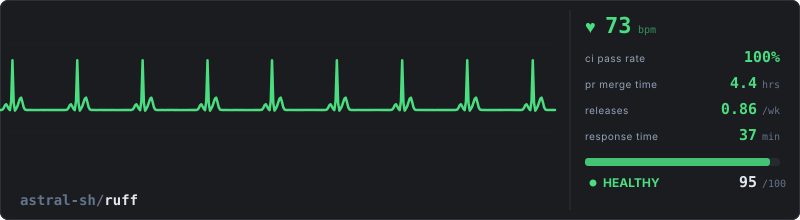

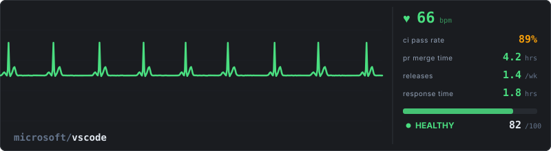

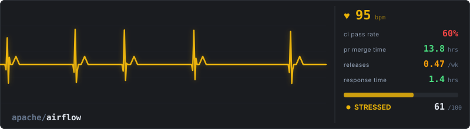


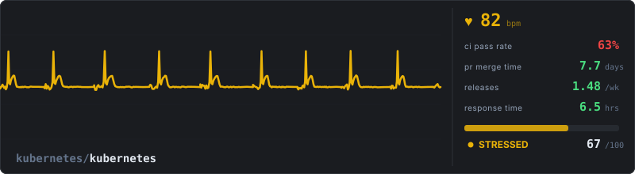

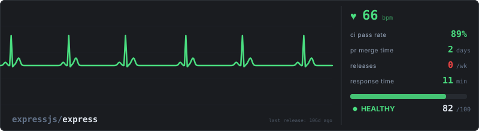

### Compact Formats

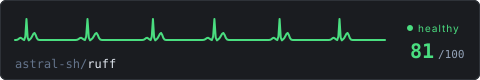
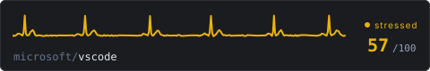
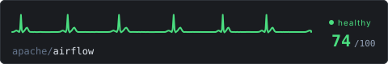

| Repo | Badge |
|---|---|
| astral-sh/ruff | 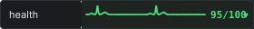 |
| microsoft/vscode | 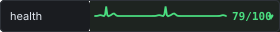 |
| apache/airflow |  |
| flutter/flutter | 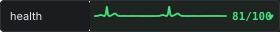 |

---

## Reading the Monitor

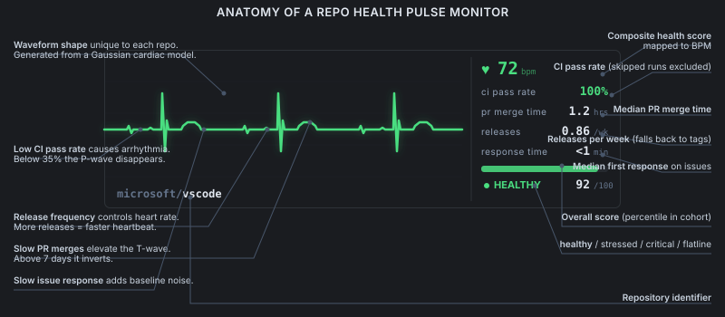

Four vital signs drive the entire visualization:

| Vital Sign | What it controls on the ECG |
|---|---|
| **CI Pass Rate** | Rhythm regularity. Low CI = arrhythmia. Below 35% the P-wave disappears. Below 30% the ST segment elevates (heart attack). |
| **PR Merge Time** | T-wave stress. Slow merges = elevated T-wave. Above 7 days it inverts. |
| **Release Cadence** | Heart rate. More releases = faster heartbeat. No activity = flatline. |
| **Issue Response** | Baseline stability. Slow response = noisy, wandering baseline between beats. |

Each repo gets a **unique waveform** generated from its individual metrics using a Gaussian cardiac model. Same repo always produces the same ECG.

---

## Quick Start

### GitHub Action

```yaml
name: Health Pulse
on:
  schedule:
    - cron: '0 6 * * *'
  workflow_dispatch:
permissions:
  contents: write
  actions: read
  pull-requests: read
  issues: read
jobs:
  pulse:
    runs-on: ubuntu-latest
    steps:
      - uses: actions/checkout@v4
      - uses: andreahlert/repo-health-pulse@master
        with:
          format: monitor
          output-path: .github/health-pulse.svg
      - uses: stefanzweifel/git-auto-commit-action@v5
        with:
          commit_message: "Update health pulse [skip ci]"
          file_pattern: ".github/health-pulse.svg"
```

Then in your README:

```markdown
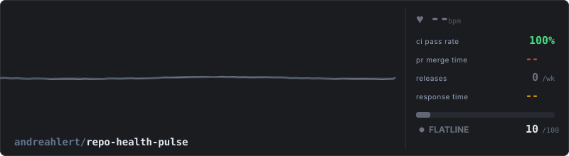
```

### CLI

```bash
npx repo-health-pulse apache/airflow                                    # stdout
npx repo-health-pulse microsoft/vscode --format mini --output health.svg
npx repo-health-pulse                                                   # detects from git remote
```

### Formats

| Format | Size | Use case |
|---|---|---|
| `monitor` | 800x220 | Full dashboard with ECG + vital signs panel |
| `mini` | 480x80 | Compact, just ECG line + score |
| `badge` | 280x32 | Inline, shields.io style |

---

## How Scoring Works

### Population-Based, Not Arbitrary

Scores come from **real data collected from 286 active GitHub repos** (1k to 500k stars). Each metric is scored as a percentile rank within the population. No arbitrary thresholds.

### Cohort System

A 500MB monorepo is not comparable to a 5MB library. The system detects four cohorts and adjusts what "normal" means:

| Cohort | CI Median | PR Merge Median | Release Median |
|---|---|---|---|
| Tiny (<10MB) | 55% | 84h | 0/wk |
| Medium (10-100MB) | 80% | 21h | 0/wk |
| Big (100-500MB) | 80% | 17h | 0.31/wk |
| Huge (500MB+) | 70% | 18h | 0.31/wk |

### The "Normal Patient" (Population Median)

The reference is not an ideal. It's the actual average:

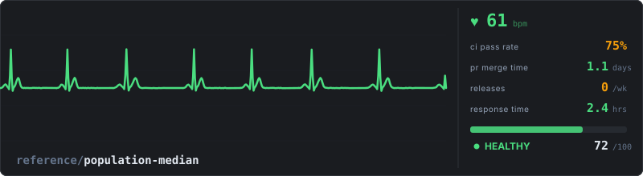

A tiny repo with 84h PR merge time is **average** for its size. The same number in a huge repo would be **below average**.

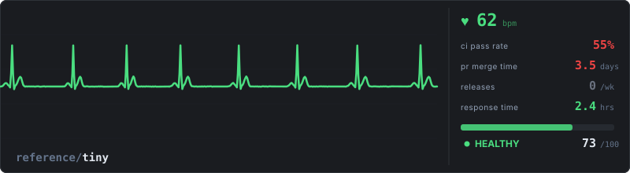

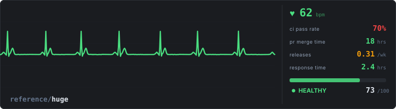

### Scoring Weights

| Metric | Weight | Rationale |
|---|---|---|
| CI Pass Rate | 30% | Core signal of code health |
| PR Merge Time | 30% | Team responsiveness |
| Issue Response | 25% | Community engagement |
| Release Cadence | 15% | Optional (55% of repos don't use GitHub Releases) |

### Classification

| State | Score | What it means |
|---|---|---|
| **Healthy** | >= 70 | Above p50 in most metrics. Top 26% of the population. |
| **Stressed** | 50-69 | Around cohort median. The normal state (53% of repos). |
| **Critical** | 30-49 | Below median on multiple metrics. Needs attention. |
| **Flatline** | < 30 | Abandoned. No PRs merged in the last 30 days AND no releases. Only 3% of repos. |

The key rule: **flatline requires inactivity, not just a low score.** A repo with bad metrics but PRs merging is critical, not dead.

### Population Distribution (286 repos)

| State | Count | % |
|---|---|---|
| Healthy | 75 | 26% |
| Stressed | 153 | 53% |
| Critical | 48 | 17% |
| Flatline | 10 | 3% |

### Smart Edge Cases

- **Skipped CI runs** (cherry-picks, conditional jobs) excluded from pass rate
- **No GitHub Releases?** Falls back to git tags. No tags + active PRs = neutral score
- **Bot auto-replies** detected and capped at score 50
- **Flutter-style projects** that use custom release channels aren't penalized for missing GitHub Releases if they have recent PR activity

---

## Population Analysis Findings

Data from 286 repos across 10+ languages, 1k to 500k stars.

| Finding | Implication |
|---|---|
| **55% of repos don't use GitHub Releases** | Release cadence can't be a primary health signal |
| **CI median is 75%** | Flaky CI is normal in monorepos, not a sign of bad code |
| **PR merge median is 27h** | One-day turnaround is standard, not slow |
| **Huge repos merge PRs faster** (18h vs 84h for tiny) | More reviewers = faster process |
| **Old repos (11y+) have better CI** (80% vs 55% for young) | Mature pipelines improve over time |

---

## ECG Anatomy

The waveform uses a Gaussian sum model matching real ECG anatomy (Lead II):

| Wave | Proportion | Maps to |
|---|---|---|
| P wave | ~1/8 of R height | Disappears when CI < 35% (atrial fibrillation) |
| QRS complex | Dominant peak | Always present, amplitude varies with CI stability |
| T wave | ~1/4 of R, asymmetric | Elevates with slow PR merge, inverts above 7 days |
| TP segment | Compresses with speed | Shrinks when releases are frequent (faster heart rate) |
| Baseline | Flat when healthy | Wanders when issue response is slow |

---

## Action Reference

### Inputs

| Input | Default | Description |
|---|---|---|
| `token` | `github.token` | GitHub token with read access |
| `format` | `monitor` | `monitor`, `mini`, or `badge` |
| `output-path` | `.github/health-pulse.svg` | Where to write the SVG |

### Outputs

| Output | Description |
|---|---|
| `score` | Composite health score (0-100) |
| `state` | `healthy`, `stressed`, `critical`, or `flatline` |
| `bpm` | Display BPM value |

---

## Known Limitations

- **GitHub-only metrics.** Projects using LKML, Bugzilla, or external tools appear less active than they are.
- **Release detection.** Custom distribution channels (Flutter channels, Go toolchain) aren't always visible via GitHub API.
- **Response time skew.** Repos with 10k+ open issues naturally have slower median response times.
- **CI sampling.** The 30-run sample may not be representative for repos with hundreds of workflow files.

## License

MIT
